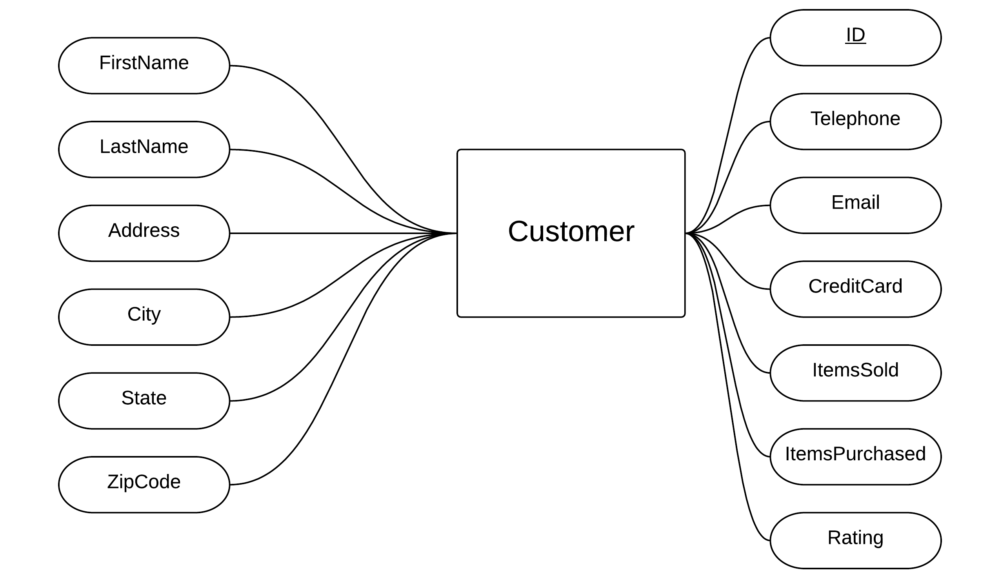
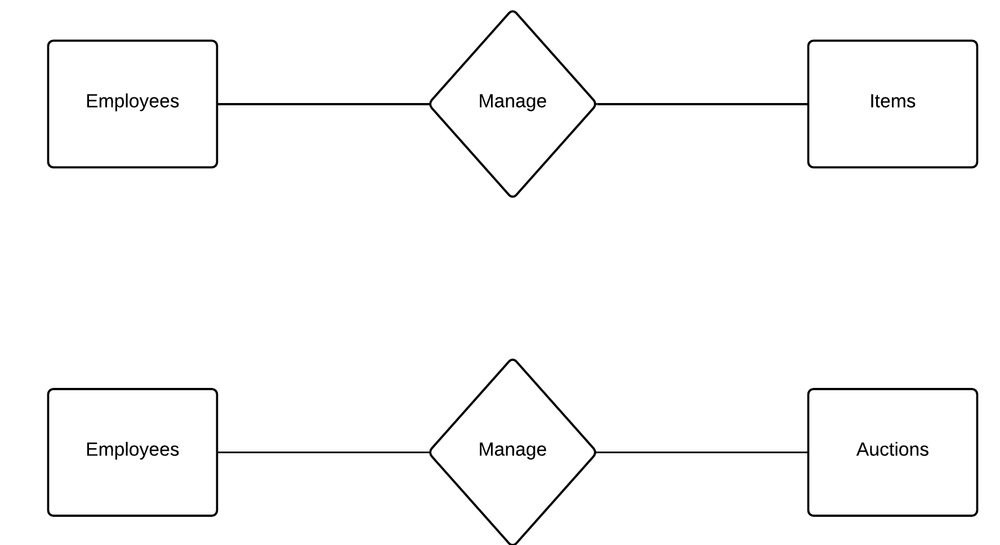

Group Assignment 1

## Team Avatar'); DROP TABLE students;--

### Members

1. Aditya Balwani : aditya.balwani@stonybrook.edu
2. Halaa Menasy : halaa.menasy@stonybrook.edu
3. Philippe Kimura-Thollander : philippe.kimura-thollander@stonybrook.edu

### ER Model + Rationale

Auctions, Employees, Customer, and Item are the 4 main entities of our database. The following diagrams list their attributes. In case of Auctions, Customers and Items, the ID is the Primary Key of the table and in case of Employees, the SSN is the Primary Key.

#### Auctions


<div class="page-break"></div>

#### Item

For ItemType in Items, the value can only be one of 'Jewelry', 'DVD', 'Silverware', 'Books', 'Sports', 'Memes', 'Games', 'Electronics', 'People' and 'Other'


#### Customer


<div class="page-break"></div>

#### Employee

There are 2 types of employees, Managers and Customer Representatives. The Manager has can Add, Modify and Delete employee data.


<div class="page-break"></div>

Employees can help customers by editing their info and they can also add and remove customers. They can also get a list of all the customers.

Employees can create, edit and delete items.

They are also are involved in the auction process and oversee the auction. They also record the sale at the end of an auction.




<div class="page-break"></div>

#### Bids

The BidsIn Relationship represents shows that a customer can bid on an Item. The bid has a Timestamp of when the bid was made along with the value. The Bids are tracked in the Bids table and are uniquely identified by their BidID.


#### Wins

At the end of an action, the customer with the Highest bid wins the Auction and gets possession of them item. The Wins Relationship references the BidID in the BidsIn Relationship and also lists the time when the customer won the auction.


Employees can also get a list of items that are won frequently using the Wins Relationship.


<div class="page-break"></div>

#### Searches

Customers can search for items to see if they are on Auction. The search is recorded in the Searches Relationship which also keeps track of how many times a customer searched for an item, which will be used for future item suggestions.


<div class="page-break"></div>

### SQL Tables with Descriptions

#### Items table

The items table lists all the attributes of an item. The item type is of domain Item types which contains the values 'Jewelry', 'DVD', 'Silverware', 'Books', 'Sports', 'Memes', 'Games', 'Electronics', 'People', 'Other'.

The ItemID is the Primary Key for this table because no 2 items can have the same ID. ID is also auto incremented by 1 everytime a new entry is added.

When the item entry is added, it has no stock and no copies sold hence their value is defaulted to 0

```
CREATE TABLE Items (
    ID INTEGER NOT NULL AUTO_INCREMENT,
    Name CHAR(100) NOT NULL,
    Type ItemTypes DEFAULT "Other",
    YearManufactured INTEGER,
    CopiesSold INTEGER DEFAULT 0,
    AmountInStock INTEGER DEFAULT 0,
    PRIMARY KEY (ID)
  )

CREATE DOMAIN ItemTypes CHAR(15)
    CHECK ( VALUE IN ('Jewelry', 'DVD', 'Silverware', 'Books', 'Sports', 'Memes', 'Games', 'Electronics', 'People', 'Other'))
```

#### Customers table

The items table lists all the attributes of an item.

The ID is the primary key for the table and is autoincremented.

Most of the keys in this table are required so that we dont have empty profiles for a customer.

We use a 0 to 5 rating system. Every customer starts with an average rating of 3 and based on their sell and purchase history the rating either goes up or down.

```
CREATE TABLE Customers (
    ID INTEGER NOT NULL AUTO_INCREMENT,
    LastName CHAR(30) NOT NULL,
    FirstName CHAR(30) NOT NULL,
    Address  CHAR(100) NOT NULL,
    City CHAR(30) NOT NULL,
    State CHAR(30) NOT NULL,
    ZipCode INTEGER NOT NULL,
    Telephone CHAR(20) NOT NULL,
    Email CHAR(60) NOT NULL,
    CreditCardNumber CHAR(20) NOT NULL,
    ItemsSold INTEGER DEFAULT 0,
    ItemsPurchased INTEGER DEFAULT 0,
    Rating INTEGER DEFAULT 3,
    PRIMARY KEY (ID)
  )
```

#### Employees table

Much like the Customer Table, most of the keys in the Employees table are required. Since Employees dont have an ID, we use the SSN as the primary key.

Employees are of 3 types, which are Manager, Customer Representative or other.

```
CREATE TABLE Employees (
    SSN CHAR(10)NOT NULL,
    LastName CHAR(30) NOT NULL,
    FirstName CHAR(30) NOT NULL,
    Address  CHAR(100) NOT NULL,
    City CHAR(30) NOT NULL,
    State CHAR(30) NOT NULL,
    ZipCode INTEGER NOT NULL,
    Telephone CHAR(20) NOT NULL,
    StartDate TIMESTAMP DEFAULT NOW(),
    HourlyRate FLOAT NOT NULL,
    Type Types
    PRIMARY KEY (SSN)
  )

CREATE DOMAIN EmpTypes CHAR(10)
    CHECK ( VALUE IN ('Manager','CustRep','Other'))
```

<div class="page-break"></div>

#### Auctions table

Auction table has ID as the primary key and is autoincremented.
The auction table references the Items, Customers and Employees table using their ID as the foreign key.

The Auction will be deleted if the Item or the items seller is deleted.
If the buyer is deleted then no action is performed.

```
CREATE TABLE Auctions(
    AuctionID INTEGER NOT NULL AUTO_INCREMENT,
    ItemID INTEGER ,
    SellerID  INTEGER,
    BuyerID INTEGER,
    OpeningTime TIMESTAMP,
    ClosingTime TIMESTAMP,
    OpeningBid FLOAT DEFAULT 0,
    ClosingBid FLOAT DEFAULT 0,
    CurrentBid FLOAT DEFAULT 0,
    CurrentHighBid FLOAT DEFAULT 0,
    Reserve FLOAT DEFAULT 0,
    Increment FLOAT DEFAULT 0,
    EmployeeID INTEGER,
    PRIMARY KEY (AuctionID),
    FOREIGN KEY (ItemID) REFERENCES Items (ID)
      ON DELETE CASCADE,
      ON UPDATE CASCADE,
    FOREIGN KEY (SellerID) REFERENCES Customers(ID)
      ON DELETE CASCADE,
    FOREIGN KEY (BuyerID) REFERENCES Customers(ID)
      ON DELETE NO ACTION
  )
```

<div class="page-break"></div>

#### Bids Table

The Bids table lists all the bids and references the Customers who made the bid using the ID as the foreign key and the Auction in which the bid was made using the AuctionID. It also contains the time of when the bid was made and value of the bid. The bid ID is the primary key and is autoincremented. Since a customer can make multiple bids in an auction, the CustomerID and the AuctionID are not primary but are foreign keys.

If a customer is deleted then their bidding history is also deleted.

If the auction is deleted then all the bids in that auction are also deleted.

```
CREATE TABLE Bids (
    ID INTEGER NOT NULL AUTO_INCREMENT,
    Time TIMESTAMP DEFAULT NOW(),
    Amount FLOAT DEFAULT 1,
    CustomerID INTEGER,
    AuctionID INTEGER,
    PRIMARY KEY (ID),
    FOREIGN KEY (CustomerID) REFERENCES Customers(ID)
      ON DELETE CASCADE,
    FOREIGN KEY (AuctionID) REFERENCES Auctions(ID)
      ON DELETE CASCADE
  )
```

<div class="page-break"></div>

#### Wins Table

Wins table lists all the purchases or "victories" in an auctions. It references the BidID in the Bids table and the CustomerID and AuctionID in their respective tables.

If the bid is deleted then we dont want to delete the wins because the wins act as a purchase history for the Customers. Same goes for when an Auction is deleted. This is because if the customer who made the auction is deleted then auction will be deleted but the winner of the auction still needs his auction history.

```
CREATE TABLE Wins (
    BidID INTEGER,
    Time TIMESTAMP DEFAULT NOW(),
    CustomerID INTEGER,
    AuctionID INTEGER,
    PRIMARY KEY (BidID, CustomerID, AuctionID)
    FOREIGN KEY (BidID) REFERENCES Bids(ID)
      ON DELETE NO ACTION,
    FOREIGN KEY (CustomerID) REFERENCES Customers(ID)
      ON DELETE CASCADE,
    FOREIGN KEY (AuctionID) REFERENCES Auctions(ID)
      ON DELETE NO ACTION
  )
```

#### Searches table

The searches table keeps track of what people search for and how frequently an item is searched for.

It references the customerID to see who searched and it also the itemID of what they searched.
If the customer is deleted then all their search is also deleted, and if an item is deleted all associated searches are deleted

```
CREATE TABLE Searches (
    CustomerID INTEGER,
    ItemID INTEGER,
    Frequency INTEGER DEFAULT 0,
    PRIMARY KEY (CustomerID, ItemID)
    FOREIGN KEY (CustomerID) REFERENCES Customers(ID)
      ON DELETE CASCADE,
    FOREIGN KEY (ItemID) REFERENCES Items(ID)
      ON DELETE CASCADE
  )
```

<div class="page-break"></div>

### Collaboration plan

Philippe Kimura-Thollander will handle item and auction data. He will make sure the data is properly handled and working for the process of bid selling and buying.

Halaa Menasy will focus on proxy bidding. This means she will focus on how the auctions will be taking place as well as restrictions and regulations on how bids are processed.

Aditya Balwani will be dedicated to the customer and employee data. He will be handling how customers and employees are saved in the database as well as how those two groups can interact with each other, including managers and customer representatives.
