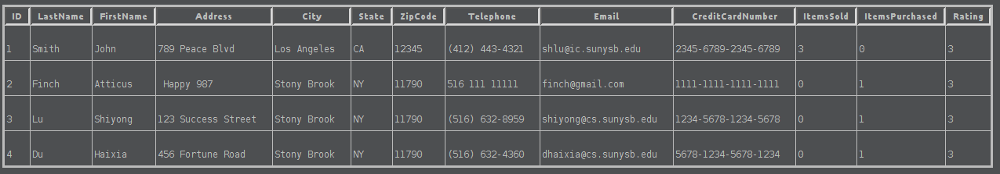
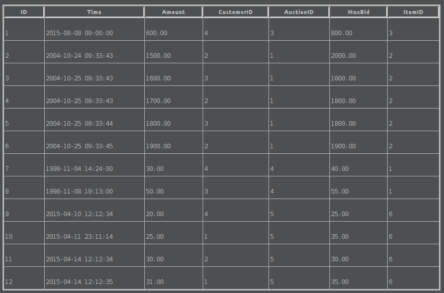
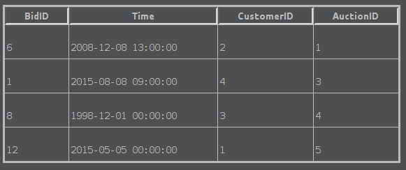

# Group Assignment 2

## Data Dumps

### Items table


### Customers table



### Employees table


### Auctions table


### Bids table



### Wins table



### Searches table


### Add, Modify and Delete employees

#### Add

##### Format

Parameters

1. ?ssn : Social security of employee. String, 12 characters
2. ?lastName : Last name of employee. String, upto 30 characters
3. ?firstName : First name of employee. String, upto 30 characters
4. ?address : Address of employee. String, upto 100 characters
5. ?city : City where employee lives. String, upto 30 characters
6. ?state : State where employee lives. String, upto 30 characters
7. ?zipCode : Zip code of employee. Integer.
8. ?startDate : Date when employee started. Format yyyy-mm-dd
9. ?hourlyRate : Employee's hourly salary. Decimal Format 10.2f
10. ?type : Type of employee. "Manager", "Employee", or "Customer Representative"


```SQL
START TRANSACTION;
  INSERT INTO Employees(SSN, LastName, FirstName, Address, City, State, ZipCode, Telephone, StartDate, HourlyRate, Type)
  VALUES (?ssn, ?lastName, ?firstName, ?address, ?city, ?state, ?zipcode,?phone,?startDate,?hourlyRate,?type);
COMMIT;
```

##### Sample Call

#### Modify

##### Format

Parameters:
1. ?FirstName : First name of Employee. String upto 30 characters
2. ?id : ID of employee. Integer

```SQL
START TRANSACTION;
  UPDATE Employees
  SET FirstName = ?FirstName
  WHERE ID = ?id
COMMIT
```

##### Sample Call

#### Delete

##### Format

Parameters:
1. ID of the employee to be deleted. Integer

```SQL
BEGIN TRANSACTION;
  DELETE FROM Employees
  WHERE ID = ?id
COMMIT;
```

##### Sample Call

### Obtain a sales report for a particular month

##### Format

```SQL
CREATE VIEW Sales_Report AS
  SELECT Items.ID AS ItemID, Bids.ID AS BidID, Customers.ID AS CustomerID, Employees.SSN AS MonitorSSN, Wins.Time AS Time, concat(Customers.LastName, ' ', Customers.FirstName) AS BoughtBy, Bids.Amount AS Amount, Customers.Email As Email, Items.Name AS ItemName, Items.Type AS ItemType, concat(Employees.FirstName, ' ', Employees.LastName) AS MonitorName
  FROM Wins, Bids, Customers, Items, Employees, Auctions
  WHERE Wins.BidID = Bids.ID
      AND Bids.CustomerID = Customers.ID
      AND Bids.ItemID = Items.ID
      AND Bids.AuctionID = Auctions.ID
      AND Auctions.EmployeeID = Employees.SSN;

SELECT * FROM Sales_Report;
```

##### Sample Call

### Comprehensive Listing of all items

##### Format

```SQL
SELECT * FROM Items
```

##### Sample Call

### Produce a list of sales by item name or by customer name

#### List of sales by item name

##### Format

Parameters
1. itemName : Name of item. String upto 30 characters

```SQL
SELECT * FROM Sales_Report WHERE ItemName = ?itemName
```

##### Sample

#### List of sales by customer name

##### Format

Parameters:
1. ?name : Name of Customer. String upto 60 characters

```SQL
SELECT * FROM Sales_Report WHERE BoughtBy = ?name;
```

##### Sample Call

### Revenue generated

#### By ItemName

##### Format

```SQL
SELECT SUM(Amount) AS Revenue, COUNT(Amount) AS CopiesSold from Sales_Report where ItemName = 'Titanic';
```

##### Sample Call

#### By ItemType

##### Format

```SQL
SELECT ItemName, SUM(Amount) AS Revenue, COUNT(Amount) AS CopiesSold FROM Sales_Report WHERE ItemType = 'DVD' GROUP BY ItemName;
```

##### Sample Call

#### By CustomerName

##### Format

```SQL
SELECT ItemName, SUM(Amount) AS Revenue, COUNT(Amount) AS CopiesSold FROM Sales_Report WHERE BoughtBy = 'Du Haixia' GROUP BY ItemName
```

##### Sample Call### Revenue generated by customer representative

##### Format

```SQL
SELECT BoughtBy as CustomerName, CustomerID, SUM(Amount) AS Revenue, COUNT(Amount) AS ItemsPurchased FROM Sales_Report GROUP BY MonitorSSN ORDER BY Revenue DESC LIMIT 1
```

##### Sample Call

### Max Revenue generated by customer

##### Format

```SQL
SELECT BoughtBy as CustomerName, CustomerID, SUM(Amount) AS Revenue, COUNT(Amount) AS ItemsPurchased FROM Sales_Report GROUP BY MonitorSSN ORDER BY Revenue DESC LIMIT 1
```

##### Sample Call

### Best Sellers

##### Format

```SQL
SELECT ItemName, SUM(Amount) AS Revenue, COUNT(Amount) AS CopiesSold FROM Sales_Report GROUP BY ItemID ORDER BY Revenue DESC
```

##### Sample Call
