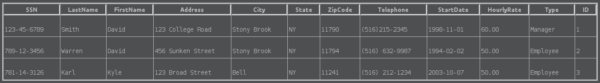
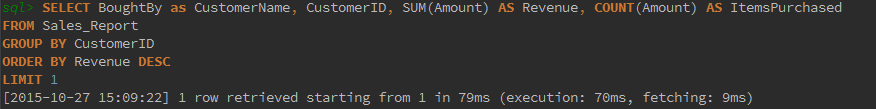

# CSE 305 Group Assignment 2

## Team Avatar'); DROP TABLE students;--

### Website Name : www.ebae.com

#### Members

1. Aditya Balwani : aditya.balwani@stonybrook.edu
2. Halaa Menasy : halaa.menasy@stonybrook.edu
3. Philippe Kimura-Thollander : philippe.kimura-thollander@stonybrook.edu

## Data Dumps

### Items table


### Customers table


### Employees table



### Auctions table


### Bids table


<div class="page-break"></div>

### Wins table


### Searches table


## Manager Level Transactions

### Add, Modify and Delete employees

#### Add

##### **Format**

Parameters :

1. ?ssn : Social security of employee. String, 12 characters
2. ?lastName : Last name of employee. String, upto 30 characters
3. ?firstName : First name of employee. String, upto 30 characters
4. ?address : Address of employee. String, upto 100 characters
5. ?city : City where employee lives. String, upto 30 characters
6. ?state : State where employee lives. String, upto 30 characters
7. ?zipCode : Zip code of employee. Integer.
8. ?startDate : Date when employee started. **Format** yyyy-mm-dd
9. ?hourlyRate : Employee's hourly salary. Decimal **Format** 10.2f
10. ?type : Type of employee. "Manager", "Employee", or "Customer Representative"

<div class="page-break"></div>

```SQL
START TRANSACTION;
  INSERT INTO Employees(SSN, LastName, FirstName, Address, City, State, ZipCode, Telephone, StartDate, HourlyRate, Type)
  VALUES (?ssn, ?lastName, ?firstName, ?address, ?city, ?state, ?zipcode,?phone,?startDate,?hourlyRate,?type);
COMMIT;
```

##### **Sample Call**


#### Modify

##### **Format**

Parameters :
1. ?FirstName : First name of Employee. String upto 30 characters
2. ?id : ID of employee. Integer

```SQL
START TRANSACTION;
  UPDATE Employees
  SET FirstName = ?FirstName
  WHERE ID = ?id
COMMIT
```

##### **Sample Call**


<div class="page-break"></div>

#### Delete

##### **Format**

Parameters :
1. ID of the employee to be deleted. Integer

```SQL
BEGIN TRANSACTION;
  DELETE FROM Employees
  WHERE ID = ?id
COMMIT;
```
page-break
##### **Sample Call**


### Obtain a sales report for a particular month

##### **Format**

```SQL
CREATE VIEW Sales_Report AS
  SELECT Items.ID AS ItemID, Bids.ID AS BidID, Customers.ID AS CustomerID, Employees.ID AS MonitorID, Wins.Time AS Time, concat(Customers.LastName, ' ', Customers.FirstName) AS BoughtBy, Bids.Amount AS Amount, Customers.Email As Email, Items.Name AS ItemName, Items.Type AS ItemType, concat(Employees.FirstName, ' ', Employees.LastName) AS MonitorName
  FROM Wins, Bids, Customers, Items, Employees, Auctions
  WHERE Wins.BidID = Bids.ID
      AND Bids.CustomerID = Customers.ID
      AND Bids.ItemID = Items.ID
      AND Bids.AuctionID = Auctions.ID
      AND Auctions.EmployeeID = Employees.ID;

SELECT * FROM Sales_Report;
```

<div class="page-break"></div>

##### **Sample Call**


### Comprehensive Listing of all items

##### **Format**

```SQL
SELECT * FROM Items
```

##### **Sample Call**


### Produce a list of sales by item name or by customer name

#### List of sales by item name

##### **Format**

Parameters :
1. ?itemName : Name of item. String upto 30 characters

<div class="page-break"></div>

```SQL
SELECT * FROM Sales_Report WHERE ItemName = ?itemName
```

##### **Sample Call**


#### List of sales by customer name

##### **Format**

Parameters :
1. ?name : Name of Customer. String upto 60 characters

```SQL
SELECT * FROM Sales_Report WHERE BoughtBy = ?name;
```

##### **Sample Call**


### Revenue generated

#### By ItemName

##### **Format**

Parameters :
1. ?itemName : Name of item. String upto 30 characters

```SQL
SELECT SUM(Amount) AS Revenue, COUNT(Amount) AS CopiesSold from Sales_Report where ItemName = ?itemName;
```

##### **Sample Call**


<div class="page-break"></div>

#### By ItemType

##### **Format**

Parameters :
1. ?itemType : Type of item. String upto 30 characters

```SQL
SELECT ItemName, SUM(Amount) AS Revenue, COUNT(Amount) AS CopiesSold FROM Sales_Report WHERE ItemType = ?itemType GROUP BY ItemName;
```

##### **Sample Call**


#### By CustomerName

##### **Format**

Parameters :
1. ?customerName : Name of customer. String upto 60 chars

```SQL
SELECT ItemName, SUM(Amount) AS Revenue, COUNT(Amount) AS CopiesSold FROM Sales_Report WHERE BoughtBy = ?customerName GROUP BY ItemName
```

##### **Sample Call**


### Max revenue generated by customer representative

##### **Format**

```SQL
SELECT SUM(Amount) AS Revenue, COUNT(Amount) AS ItemsSold
FROM Sales_Report
GROUP BY MonitorID
ORDER BY Revenue DESC
LIMIT 1
```

##### **Sample Call**


### Max Revenue generated by customer

##### **Format**

```SQL
SELECT BoughtBy as CustomerName, CustomerID, SUM(Amount) AS Revenue, COUNT(Amount) AS ItemsPurchased
FROM Sales_Report
GROUP BY CustomerID
ORDER BY Revenue DESC
LIMIT 1
```

##### **Sample Call**




### Best Sellers

##### **Format**

```SQL
SELECT ItemName, SUM(Amount) AS Revenue, COUNT(Amount) AS CopiesSold
FROM Sales_Report
GROUP BY ItemID
ORDER BY Revenue DESC
LIMIT 10
```

<div class="page-break"></div>

##### **Sample Call**


## Customer Representative level Transactions

### Record a sale

##### **Format**

Parameters :
?BidID: ID of the bid. Integer
?Time: Time the sale was made. Date value
?WinnerID: ID of the customer who won the auction. Integer
?AuctionID: ID of the auction. Integer
?ItemID: ID of the item being updated. Integer

```SQL
START TRANSACTION;
INSERT INTO Wins (BidID, Time, CustomerID, AuctionID)
VALUES (?BidID,?Time,?WinnerID, ?AuctionID);

UPDATE Items
SET CopiesSold = CopiesSold + 1, Stock=Stock-1
WHERE ID=?ItemID

UPDATE Customers
SET ItemsSold=ItemsSold+1
WHERE ID = (SELECT SellerID
     FROM Auctions
     WHERE ID = ?AuctionID);

UPDATE Customers
SET ItemsPurchased=ItemsPurchased+1
WHERE ID = ?WinnerID
COMMIT;
```

<div class="page-break"></div>

##### **Sample Call** :

```SQL
START TRANSACTION;
  INSERT INTO Wins (BidID, Time, CustomerID, AuctionID)
  VALUES (6,"2008-12-08 13:00:00",2, 1);

  UPDATE Items
  SET CopiesSold = CopiesSold + 1, Stock=Stock-1
  WHERE ID=1

  UPDATE Customers
  SET ItemsSold=ItemsSold+1
  WHERE ID = (SELECT SellerID
       FROM Auctions
       WHERE ID = 1);

  UPDATE Customers
  SET ItemsPurchased=ItemsPurchased+1
  WHERE ID = 2
COMMIT;
```

Wins Table

    ---->


<div class="page-break"></div>

Items Table

    ---->


Customers Table

    ---->


### Add, Edit, Delete inFormation for a customer

#### Add

##### **Format**

```SQL
START TRANSACTION;
    INSERT INTO Customers (ID, LastName, FirstName, Address, City, State, ZipCode, Telephone, Email, CreditCardNumber,ItemsSold,ItemsPurchased,Rating)
    Values ('?ID', '?LastName', '?FirstName', '?Address', '?City', '?NY', '?Zipcode', '?Telephone', '?email', '?CreditCardNumber', '?ItemsSold','?ItemsPurchased','?Rating')
COMMIT;
```

<div class="page-break"></div>

Parameters :

1. ?ID: ID of the customer: Integer
2. ?lastName: Last name of the customer. String, up to 30 characters
3. ?firstName : First name of customer. String, upto 30 characters
4. ?address : Address of customer. String, upto 100 characters
5. ?city : City where customer lives. String, upto 30 characters
6. ?state : State where customer lives. String, upto 30 characters
7. ?zipCode : Zip code of customer. Integer.

##### **Sample Call** :

```SQL
START TRANSACTION;
    INSERT INTO Customers (ID, LastName, FirstName, Address, City, State, ZipCode, Telephone, Email, CreditCardNumber,ItemsSold,ItemsPurchased,Rating)
    Values ('5', 'Allen', 'Barry', ' Flash 52', 'Central City', 'NY', '11790', '516 121 1212', 'flash@gmail.com', '1212-1212-1212-1212','0','0','3')
COMMIT;
```


    
---->


#### Edit

##### **Format**

```SQL
START TRANSACTION;
    UPDATE Customers
    SET LastName='?LastName', FirstName='?FirstName', Address= '?Address', City= '?City', State= '?State', ZipCode= ?Zipcde, Telephone= '?Telephone', Email= '?Email' , CreditCardNumber= '?CreditCardNumber',ItemsSold=
    '?ItemsSold',ItemsPurchased='?ItemsPurchased',Rating=?Rating
    WHERE ID=?ID
COMMIT;
```

<div class="page-break"></div>

Parameters :

1. ?lastName : Last name of customer. String, upto 30 characters
2. ?firstName : First name of customer. String, upto 30 characters
3. ?address : Address of customer. String, upto 100 characters
4. ?city : City where customer lives. String, upto 30 characters
5. ?state : State where customer lives. String, upto 30 character
6. ?zipCode : Zip code of customer. Integer.
7. ?telephone: telephone number of customer: String, up to 20 characters
8. ?email: email of customer: String, up to 60 characters
9. ?ID: id of customer to be updated

##### **Sample Call** :

```SQL
START TRANSACTION;
    UPDATE Customers
    SET LastName='Lang', FirstName='Lana', Address= '777 Hope Street', City= 'Smallville', State= 'NY', ZipCode= 11111, Telephone= '(516)888-8888', Email= 'lana@gmail.com' , CreditCardNumber= '1233-4444-5555-6666',ItemsSold='12',ItemsPurchased='3',Rating=1
    WHERE ID=1
COMMIT;
```

    
---->


#### Delete

```SQL
START TRANSACTION;
    DELETE FROM Customers
    WHERE ID=?ID;
COMMIT;
```

Parameters :
1. ?ID: ID of customer to be deleted: Integer

<div class="page-break"></div>

##### **Sample Call** :

```SQL
START TRANSACTION;
    DELETE FROM Customers
    WHERE ID=5;
COMMIT;
```

    
---->


###Produce customer mailing lists

##### **Format**

```SQL
START TRANSACTION;
  SELECT Email, concat(Customers.?LastName, ' ', Customers.?FirstName) AS Name
  FROM Customers
COMMIT;
```

Parameters :
1. ?email: email of customer. String, up to 60 characters
2. ?lastname: last name of customer. String, up to 30 characters
3. ?firstname: first name of cusomer. String, up to 30 characters

##### **Sample Call** :

```SQL
START TRANSACTION;
  SELECT Email, concat(Customers.LastName, ' ', Customers.FirstName) AS Name
  FROM Customers
COMMIT;
```

    

## Customer level Transactions

### Find bid history for an auction

##### **Format**

Parameters :
1. ?aID : the ID of the Auction you want to see the bid history of

```SQL
START TRANSACTION;
	SELECT *
	FROM Bids
	WHERE AuctionID = ?aID;
COMMIT;
```

##### **Sample Call**


<div class="page-break"></div>

### Find current and past auctions a customer has taken part in

##### **Format**

Parameters :
1. ?custID = the ID of the Customer you want see the current/past auctions of

```SQL
START TRANSACTION;
	SELECT *
	FROM Auctions
	WHERE ID IN (
		SELECT AuctionID
		FROM Bids
		WHERE CustomerID = ?custID
	);
COMMIT;
```

##### **Sample Call**


### Items sold by a given seller and corresponding auction info

##### **Format**

Parameters :
1. ?sellerID = the ID of the customer who's sold

```SQL
START TRANSACTION;
	SELECT *
	FROM Auctions
	WHERE SellerID = ?sellerID;
COMMIT;
```

<div class="page-break"></div>

##### **Sample Call**


### Items available of a particular type and corresponding auction info

##### **Format**

Parameters :
1. ?itemType = the type of the Item you want to see auctions for (e.g. 'DVD', 'Car')

```SQL
START TRANSACTION;
	SELECT *
	FROM Auctions
	WHERE ItemID IN (
		SELECT ID
		FROM Items
		WHERE Type = ?itemType
	);
COMMIT;
```

##### **Sample Call**


<div class="page-break"></div>

### Items available with a particular keyword or set of keywords in the item name, and corresponding auction info

##### **Format**

```SQL
START TRANSACTION;
	SELECT *
	FROM Auctions
	WHERE ID IN (
		SELECT ID
	  	FROM Items
	  	WHERE Name
	  	LIKE '%?keyword%'
	);
COMMIT;
```

?keyword = the keywords you want to match

##### **Sample Call**


### Best-Seller list

##### **Format**

```SQL
START TRANSACTION;
	SELECT Name
	FROM Items
	WHERE ID IN (
	  SELECT ItemID
	  FROM Auctions
	  WHERE ID IN (
	    SELECT AuctionID
	    FROM Wins
	  )
	);
COMMIT;
```

##### **Sample Call**


### Personalized item suggestion list

##### **Format**

```SQL
START TRANSACTION;
	SELECT Name
	FROM Items
	WHERE Type IN (
	  SELECT Type
	  FROM Items
	  WHERE ID IN (
	    SELECT ItemID
	    FROM Searches
	    WHERE CustomerID = ?custID
	  )
	)
	AND
	Items.Name NOT IN (
	  SELECT Name
	  FROM Items
	  WHERE ID IN (
	    SELECT ItemID
	    FROM Auctions
	    WHERE ID IN (
	      SELECT AuctionID
	      FROM Bids
	    )
	  )
	);
COMMIT;
```

?custID = the ID of the customer who we're creating a suggestion list for

##### **Sample Call**


### A view for customer representatives to read employee in**Format**ion, except for the hourly rate and SSN.

##### **Format**

```SQL
START TRANSACTION;
	CREATE VIEW view_employees AS (
		SELECT LastName, FirstName, Address, City, State, ZipCode, Telephone, StartDate, Type
		FROM Employees
	);
COMMIT;
```

##### **Sample Call**


### A view of a receipt of an order from a customer.

##### **Format**

```SQL
START TRANSACTION;
	CREATE VIEW receipt AS (
		SELECT C.Id, C.LastName, C.FirstName, C.Address, C.City, C.State, C.ZipCode, C.Telephone, C.Email, C.CreditCardNumber, 		I.Name, W.Time, W.AuctionID, A.CurrentBid
		FROM Customers C, Items I, Wins W, Auctions A
		WHERE W.CustomerID = C.ID AND W.AuctionID = A.ID AND A.ItemID = I.ID
	);
COMMIT;
```

<div class="page-break"></div>

##### **Sample Call**


