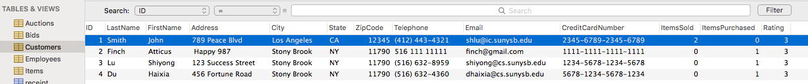
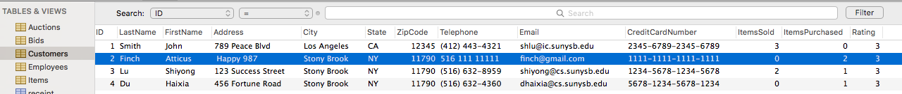
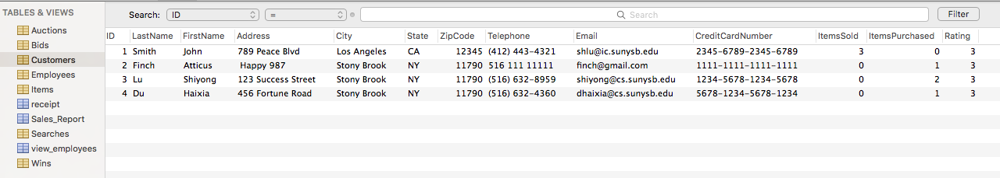
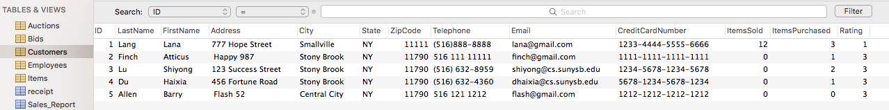
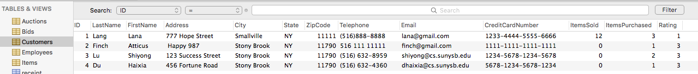

# Record a sale

__Parameters__

(Insert)
?BidID: ID of the bid. Integer
?Time: Time the sale was made. Date value
?CustomerID: ID of the customer partaking in the bid. Integer
?AuctionID: ID of the auction where the bid is happening. Integer
 
(Update Items)
?CopiesSold: number of copies sold of that item. Integer
?STOCK: how much of that item is in inventory. Integer
?ID: ID of the item being updated. Integer

(Update Customers)
?ItemsSold: number of items sold by each customer. Integer
?CustomerID: Id of the customer who you are keeping track of the items sold for. Integer
?ItemsPurchased: number of items purchased by a customer. Integer

_Sample Query_

```SQL
START TRANSACTION;
INSERT INTO Wins (BidID, Time, CustomerID, AuctionID)
VALUES ('3','2015-08-08 09:00:00','1', '3');

UPDATE Items 
SET CopiesSold = CopiesSold + 1, Stock=Stock-1
WHERE ID=1 

UPDATE Customers 
SET ItemsSold=ItemsSold+1
WHERE ID = (SELECT SellerID 
     FROM Auctions 
     WHERE ID IN 
        (SELECT AuctionID
         FROM Wins 
         WHERE CustomerID = 2));
           
UPDATE Customers 
SET ItemsPurchased=ItemsPurchased+1
WHERE ID = 2
COMMIT;            
```

    ---->


    ---->


    ---->


    ---->



# Add, Edit, Delete information for a customer

## Add
```SQL
START TRANSACTION;
    INSERT INTO Customers (ID, LastName, FirstName, Address, City, State, ZipCode, Telephone, Email, CreditCardNumber,ItemsSold,ItemsPurchased,Rating)
    Values ('?ID', '?LastName', '?FirstName', '?Address', '?City', '?NY', '?Zipcode', '?Telephone', '?email', '?CreditCardNumber', '?ItemsSold','?ItemsPurchased','?Rating')
COMMIT;
```

__Parameters__

ID: ID of the customer: Integer
?lastName: Last name of the customer. String, up to 30 characters
?firstName : First name of customer. String, upto 30 characters
?address : Address of customer. String, upto 100 characters
?city : City where customer lives. String, upto 30 characters
?state : State where customer lives. String, upto 30 characters
?zipCode : Zip code of customer. Integer.

_Sample Query_
```SQL
START TRANSACTION;
    INSERT INTO Customers (ID, LastName, FirstName, Address, City, State, ZipCode, Telephone, Email, CreditCardNumber,ItemsSold,ItemsPurchased,Rating)
    Values ('5', 'Allen', 'Barry', ' Flash 52', 'Central City', 'NY', '11790', '516 121 1212', 'flash@gmail.com', '1212-1212-1212-1212','0','0','3')
COMMIT;
```


    ---->


##Edit

```SQL
START TRANSACTION;
    UPDATE Customers 
    SET LastName='?LastName', FirstName='?FirstName', Address= '?Address', City= '?City', State= '?State', ZipCode= ?Zipcde, Telephone= '?Telephone', Email= '?Email' , CreditCardNumber= '?CreditCardNumber',ItemsSold=
    '?ItemsSold',ItemsPurchased='?ItemsPurchased',Rating=?Rating
    WHERE ID=?ID
COMMIT;
```

__Parameters__
?lastName : Last name of customer. String, upto 30 characters
?firstName : First name of customer. String, upto 30 characters
?address : Address of customer. String, upto 100 characters
?city : City where customer lives. String, upto 30 characters
?state : State where customer lives. String, upto 30 character
?zipCode : Zip code of customer. Integer.
?telephone: telephone number of customer: String, up to 20 characters
?email: email of customer: String, up to 60 characters
?ID: id of customer to be updated

_Sample Query_
```SQL
START TRANSACTION;
    UPDATE Customers 
    SET LastName='Lang', FirstName='Lana', Address= '777 Hope Street', City= 'Smallville', State= 'NY', ZipCode= 11111, Telephone= '(516)888-8888', Email= 'lana@gmail.com' , CreditCardNumber= '1233-4444-5555-6666',ItemsSold='12',ItemsPurchased='3',Rating=1
    WHERE ID=1
COMMIT;
```
    ---->


##Delete

```SQL
START TRANSACTION;
    DELETE FROM Customers
    WHERE ID=?ID;
COMMIT;
```

__Parameters__
ID: ID of customer to be deleted: Integer

_Sample Query_
```SQL
START TRANSACTION;
    DELETE FROM Customers
    WHERE ID=5;
COMMIT;
```
    ---->



##Produce customer mailing lists
```SQL
START TRANSACTION;
SELECT Email, concat(Customers.?LastName, ' ', Customers.?FirstName) AS Name
FROM Customers
COMMIT;
```

__Parameters__
?email: email of customer. String, up to 60 characters
?lastname: last name of customer. String, up to 30 characters
?firstname: first name of cusomer. String, up to 30 characters	

_Sample Query_
```SQL
START TRANSACTION;
SELECT Email, concat(Customers.LastName, ' ', Customers.FirstName) AS Name
FROM Customers
COMMIT;
```

    